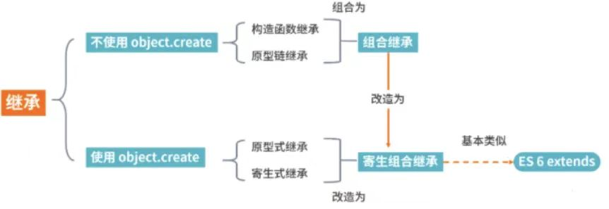

# JS中实现继承的方式

## 原型链继承

直接将父类实例赋值给子类的`prototype`

``` js
function Parent() {
    this.name = 'parent';
    this.arr = [1, 2, 3];
}

function Child() {
    this.name = 'child';
}

Child.prototype = new Parent();

const child1 = new Child();
const child2 = new Child();

child1.arr.push(4);
// 所有实例共享同一个原型对象
console.log(child1.arr === child2.arr); // true
```

##  构造函数继承

在子类构造函数中借助`call`调用`Parent`构造函数

``` js
function Parent() {
    this.name = 'parent';
    this.arr = [1, 2, 3];
}

Parent.prototype.getName = function() {
    return this.name;
}

function Child() {
    Parent.call(this);
    this.name = 'child';
}

const child = new Child();

// 只能继承父类的属性和方法，不能继承父类的原型
console.log(child.arr); // [1, 2, 3]
child.getName(); // Uncaught TypeError: child1.getName is not a function

```

## 组合继承

结合前面的原型链继承和构造函数继承方式实现

``` js
function Parent() {
    this.name = 'parent';
    this.arr = [1, 2, 3];
}

Parent.prototype.getName = function() {
    return this.name;
}

function Child() {
    // 第二次调用 Parent() 额外开销
    Parent.call(this);
    this.name = 'child';
}

// 第一次调用 Parent()
Child.prototype = new Parent();
// 手动指向自己的构造函数
Child.prototype.constructor = Child;

const child1 = new Child();
const child2 = new Child();

child1.arr.push(4);
// 互不影响
console.log(child1.arr === child2.arr); // false
// 正常调用
child1.getName(); // child
// 在Child.prototype添加了父类Parent的属性和方法
console.log(child1); // Child {name: 'child', arr: Array(4)}
console.log(Object.getPrototypeOf(child1)); // Parent {name: 'parent', arr: Array(3)}
```

## 原型式继承

借助`Object.create`方法实现

``` js
const parent = {
    name:'parent',
    arr: [1, 2, 3],
    getName: function() {
        return this.name;
    }
}

// Object.create是浅拷贝
const child1 = Object.create(parent);
child1.name = 'child1';
child1.arr.push(4);

const child2 = Object.create(parent);
child2.name = 'child2';

// 所有实例共享同一个原型对象，存在篡改的可能
console.log(child1.arr === child2.arr); // true

console.log(child1.name === child1.getName()); // true

```

## 寄生式继承

在前面原型式继承方式上进行优化，利用`Object.create`添加一些方法进行增强

``` js
const parent = {
    name:'parent',
    arr: [1, 2, 3],
    getName: function() {
        return this.name;
    }
}

function clone(original) {
    const obj = Object.create(original);
    obj.getArr = function() {
        return this.arr;
    }
    return obj;
}

// Object.create是浅拷贝
const child1 = clone(parent);
child1.name = 'child1';
child1.arr.push(4);

const child2 = clone(parent);
child2.name = 'child2';

// 所有实例共享同一个原型对象，存在篡改的可能
console.log(child1.arr === child2.arr); // true
console.log(child1.getArr() === child2.getArr()); // true

console.log(child1.name === child1.getName()); // true

console.log(child1.getArr === child2.getArr); // false
```

## 寄生组合式继承

基于前面的继承方式进行改造，是所有继承方式里相对最优的继承方式

``` js
function Parent() {
    this.name = 'parent';
    this.arr = [1, 2, 3];
}

Parent.prototype.getName = function() {
    return this.name;
}

function Child() {
    // 将父类的属性和方法添加到子类中
    Parent.call(this);
    this.name = 'child';
}

// 减少组合继承中多调用一次父类构造函数的问题
Child.prototype = Object.create(Parent.prototype);
Child.prototype.constructor = Child;

Child.prototype.getArr = function() {
    return this.arr;
}

const child = new Child();

console.log(child); // Child {name: 'child', arr: Array(3)}
console.log(child.getName()); // child
console.log(child.getArr()); // [1, 2, 3]
```

## class继承

通过`ES6`中`class`的` extends`实现

``` js
class Parent {
    constructor(name) {
        this.name = name;
    }
    // 原型方法
    getName() {
        console.log('Parent: ', this.name);
    	return this.name;
	}
}

class Child extends Person {
    constructor(name, arr) {
        // 调用父类构造函数
        super(name);
        this.arr = arr;
    }
    
    getArr() {
    	return this.arr;
	}
}

const child = new Child('child', [1, 2, 3]);
```


## 总结

