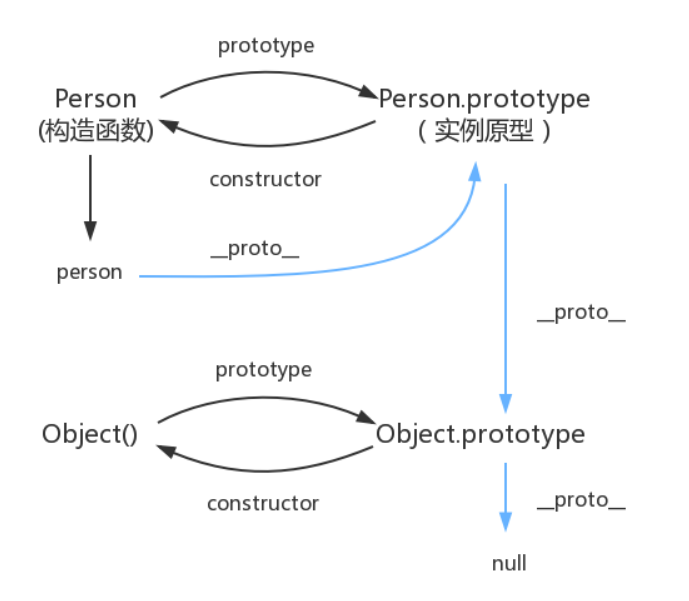

# 原型与原型链

## 原型（prototype）

在 JS 中使用构造函数来新建一个对象的，每一个构造函数的内部都有一个`prototype`属性，这个属性值是一个对象，这个对象包含了所有实例共享的属性和方法。当我们使用构造函数新建一个对象后，在这个对象的内部将包含一个指针指向构造函数的`prototype`属性对应的值，在 ES5中这个指针被称为对象的隐式原型。一般来说我们是不应该能够获取到这个值的，但是现在浏览器中都实现了 `__proto__ `属性来让我们访问这个属性，最好不要使用这个属性，因为它不是规范中规定的。推荐使用ES5 中新增的`Object.getPrototypeOf() `方法来获取对象的原型。

``` javascript
// JS中分为函数对象和普通对象，每个对象都有__proto__属性，但是只有函数对象才有 prototype 属性
let obj = {}
let func = function () {}

obj.prototype // undefined
func.prototype // { constructor: function(){...} }

func.__proto__ === func.constructor.prototype // true
```


## 原型链（\_\_proto\_\_）

  当我们访问一个对象的属性时，如果这个对象内部不存在这个属性，那么就会去它的原型对象里找这个属性，这个原型对象又会有自己的原型，于是就这样一层一层找下去，也就是原型链的概念，所以这就是我们新建的对象为什么能够使用 `toString()` 等方法原因。原型链的尽头一般来说都是`null`。


``` javascript
let obj = {
    aa: 1,
    bb: function () {

    }
}
// [[Prototype]] = __proto__ 原型链
//  关系 实例的原型链指向其构造函数的原型
// obj.__proto__ => Object.prototype
// obj.bb.__proto__ === obj.bb.constructor.prototype

// 对象访问属性的时候，在自身属性查找，找不到再去__proto__原型链上查找，直到找不到为止返回undefined
```


## 关系



- `proto`和`constructor`属性是对象所独有的；`prototype`属性是函数独有的，因为函数也是一种对象，所以函数也有`proto`和`constructor`属性
- `prototype`属性的作用是让函数所实例化的对象共享属性和方法
- `constructor`属性指向对象的构造函数，所有函数最终的构造函数都指向`Function`

- 通过`__proto__`属性将对象连接起来的链路就是原型链