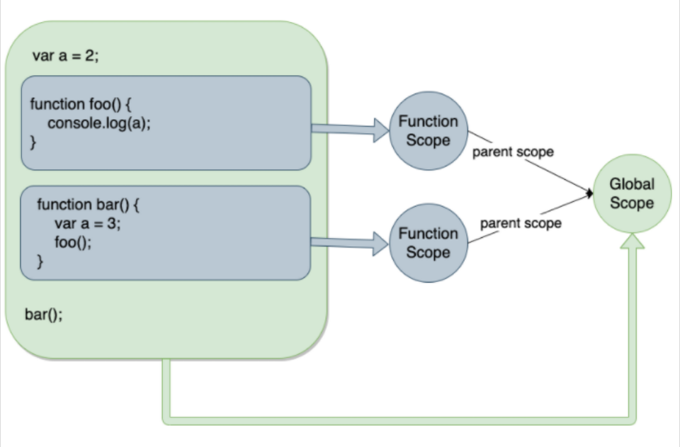
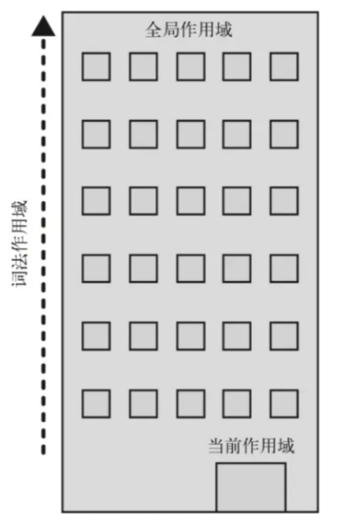

# js中的作用域

在js中，`作用域`决定了变量、函数和对象的可见性


## 作用域

一般将作用域分成以下三种

### 全局作用域（顶级作用域）

- `定义：`在函数或代码块外声明的变量，或者直接通过顶级作用域挂载的变量
- `特点：`任何位置均可访问；可重复声明容易被非预期的地方修改

``` javascript
var globalVar = 'global var';
function xxx() {
    console.log(globalVar);
}
```


### 函数作用域（局部作用域）

- `定义：`在函数内部通过`var`声明的变量
- `特点：`仅在函数内部可访问；存在变量提升的情况

``` javascript
function xxx() {
    var funVar = 'function var';
    console.log(funVar);
}
console.log(funVar); // Uncaught ReferenceError: funVar is not defined
```


### 块级作用域

- `定义：`通过`let`、`const`在代码块（{}）中声明的变量
- `特点：`仅在代码块可访问；不存在变量提升的情况

``` javascript
function xxx() {
    if (true) {
        const blockConst = 'block const';
        console.log(blockConst);
    }
    console.log(blockConst); // Uncaught ReferenceError: blockConst is not defined
}
console.log(blockConst); // Uncaught ReferenceError: blockConst is not defined
```


## 词法作用域（静态作用域）

- `定义：`函数的作用域在声明时确定，而非执行阶段确定的
- `特点：`内部函数可以访问外部函数的变量（形成闭包）

``` javascript
var a = 2;
function foo(){
    console.log(a); // 2
}
function bar(){
    var a = 3;
    foo();
}
bar()
```




## 作用域链

- `规则：`词法环境是嵌套结构，当访问变量时，会从当前作用域逐级向外层作用域查找
- `流程：`当前作用域 -> 外层函数作用域 -> 全局作用域

当访问变量时，js引擎会尝试在当前作用域下查找该变量，如果没有找到则逐级向外层作用域查找，直到查找到该变量或者到全局作用域仍未找到直接报错（非严格模式下隐式声明该变量）



``` javascript
const globalVar = 'global';

function parent() {
    const parentVar = 'parent';
    
    function child() {
        const childVar = 'child';
        console.log(globalVar); // 'global'
        console.log(parentVar); // 'parent'
    }
    
    child();
    console.log(childVar); // Uncaught ReferenceError: childVar is not defined
}

console.log(globalVar); // Uncaught ReferenceError: globalVar is not defined
```

