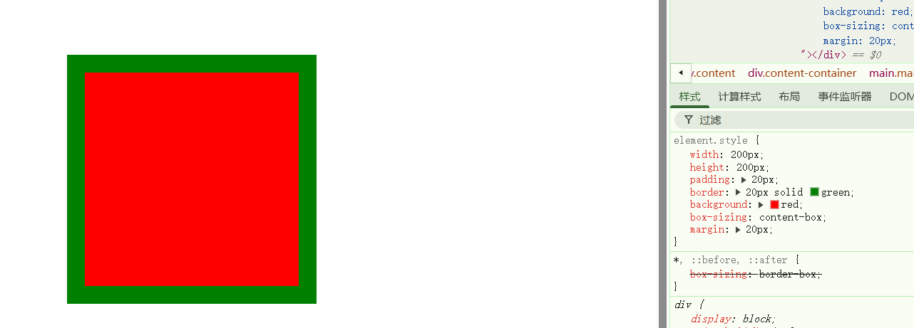
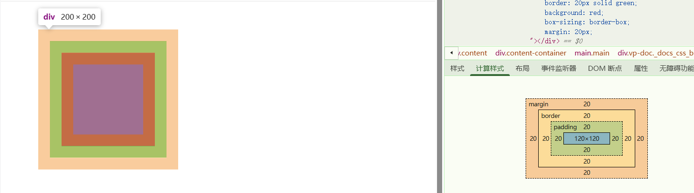

# 盒子模型

当对一个文档进行布局时，浏览器的渲染引擎会将页面上显示的每个元素都可以看作一个盒子，即盒模型；这个盒子由`content`(内容)、`padding`(内边距)、`border`(边框)、`margin`(外边距)组成。但盒子的大小由`content+padding+border`这三部分决定，把`margin`算进去的那是盒子占据的位置，而不是盒子的大小。

## W3C标准盒模型(content-box)

- 盒子总宽度 = width + padding + border;
- 盒子总宽度 = height+ padding + border;
- 盒子总占据位置 =  盒子总宽度/总高度 + margin;

``` css
.box {
    width: 200px;
    height: 200px;
    padding: 20px;
    border: 20px solid green;
    margin: 20px;
    background: red;
    box-sizing: content-box;
}

// 盒子总宽度 = 200px + 40px + 40px = 280px;
// 盒子总占据位置(横向) = 220px + 40px = 320px;
```



## IE盒模型（border-box）

- 盒子总宽度 = width;
- 盒子总宽度 = height;
- 盒子总占据位置 =  盒子总宽度/总高度 + margin;
- 盒子内容content宽度 = width - padding - border；

``` css
.box {
    width: 200px;
    height: 200px;
    padding: 20px;
    border: 20px solid green;
    margin: 20px;
    background: red;
    box-sizing: border-box;
}

// 盒子总宽度 = 200px;
// 盒子内容content宽度 = 200px - 40px - 40px = 120px;
// 盒子总占据位置(横向) = 200px + 40px = 240px;
```

