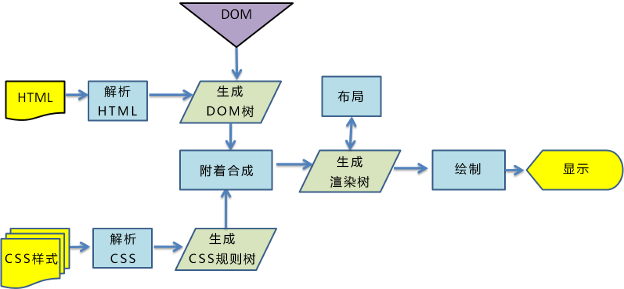

# 回流和重绘

## 回流（reflow）

布局引擎根据各种样式计算每个盒子在页面上的大小与位置。

### 触发时机

- 页面首次渲染。
- 浏览器窗口大小发生改变。
- 元素的尺寸、位置发生变化。
- 添加或者删除可见的DOM元素。
- DOM元素内容发生变化。
- 查询某些属性和调用某些方法（offsetTop、clientWidth、scrollWidth等）。

## 重绘（repaint）

发生在元素的外观改变时，但元素的几何属性（位置、大小等）保持不变。

### 触发时机

- 回流一定触发重绘。
- 元素颜色的改变。
- 可见性visibility的改变。
- 阴影的修改。

## 浏览器的渲染机制

- 首先解析收到的HTML文档，根据文档定义构建DOM树（由DOM元素及属性节点组成）。
- 解析CSS，生成CSSOM树。
- 将 DOM树和CSSOM树结合，生成渲染树（Render Tree）。
- 根据渲染树来进行布局，得到各个节点在页面上的大小和位置（回流）。
- 进入绘制阶段，遍历渲染树并调用渲染对象的paint方法，绘制元素像素信息（重绘）。
- 浏览器将各图层的信息发送给GPU，显示在页面上。

### 优化技巧

由于每次回流都会造成额外的计算消耗，因此大多数浏览器都会通过队列化修改并批量执行来优化回流过程。浏览器会将修改操作放入到队列里，直到一段时间后或者操作达到了一个阈值，才清空队列。当有获取布局信息的操作时，会强制队列刷新，触发回流来返回正确的值。

- 合并对DOM样式的修改，采用class来修改。
- DOM离线处理，减少回流重绘次数，对于要修改的元素先display: none,再进行DOM操作，操作完成再将display属性改为显示。
- 通过 documentFragment 创建一个DOM文档片段,在它上面批量操作DOM，操作完成之后，再添加到文档中，这样只会触发一次重排。
- 克隆节点，修改完再替换原始节点。
- DOM脱离普通文档流,使用absolute或fixed让元素脱离普通文档流，使用绝对定位会使的该元素单独成为渲染树中 body 的一个子元素，回流开销比较小，不会对其它节点造成太多影响。
- 如果需要对DOM进行多次访问，尽量使用局部变量缓存该DOM。
- 避免使用table布局，可能很⼩的⼀个⼩改动会造成整个table的重新布局。
- CSS选择符从右往左匹配查找，避免节点层级过多。