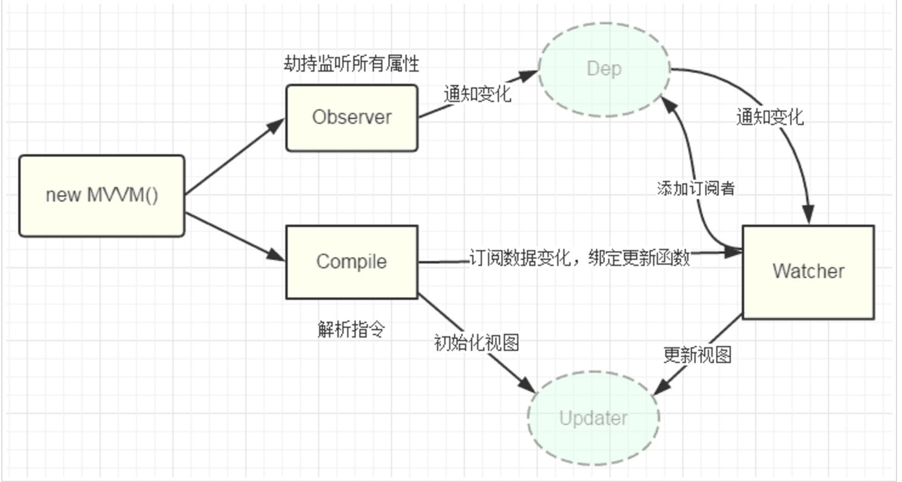
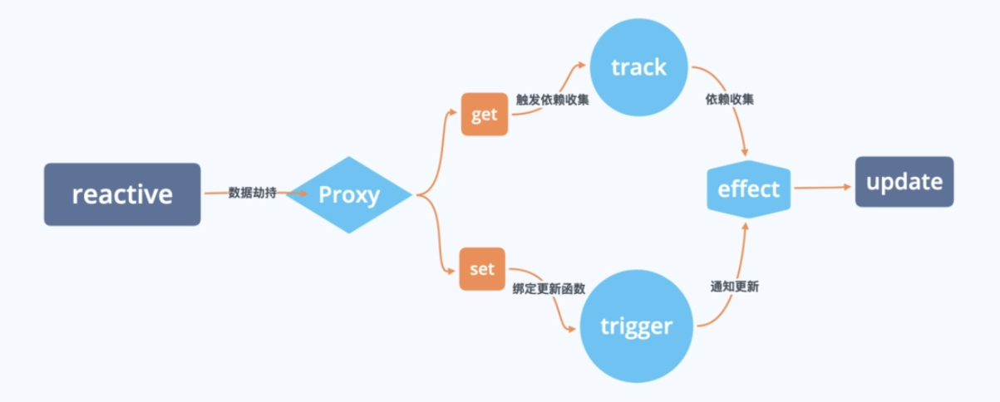

# 双向数据绑定

对于传统的`dom操作`，当数据变化时更新视图需要先获取到目标节点，然后将改变的值放入节点中；视图发生变化时，需要绑定事件修改数据。双向数据绑定恰好能解决这种繁琐的操作，数据变化后自动更新视图，视图变化后更新数据，能让开发者更加专注于处理业务逻辑。

## 实现原理

### vue2

vue2通过`Object.defineProperty`对数据进行劫持，拦截数据的`getter`和`setter`操作，实现数据变化时自动触发视图更新。

#### 数据劫持

- 初始化数据：当组件初始化时，对`data`的所有属性进行递归遍历，通过`Object.defineProperty`为每个属性设置`getter`和`setter`。
  - `getter`用于收集依赖，记录哪些地方使用到了该数据。
  - `setter`用于通知所有依赖更新，告诉试用改数据的地方重新渲染。
- 数组的特殊处理：无法直接监听数组的变化，因此重写了数组原型的7个方法（`push`、`pop`、`shift`、`unshift`、`splice`、`sort`、`reverse`），在这些方法执行时手动触发更新。

#### 依赖收集：Watcher与Dep

- Dep（依赖管理器）：每个响应式属性都会对应一个`Dep`实例，用于存储所有依赖该属性的`Watcher`。
- Watcher（订阅者）：每个组件或者表达式会对应一个`Watcher`，当数据变化时，`Watcher`会触发组件重新渲染。
- 依赖收集的过程：
  - 当组件渲染时，模板中的数据会被读取（触发`getter`）。
  - 此时`Dep`会将当前正在渲染的组件的`Watcher`添加到依赖列表中。
  - 当数据被修改时（触发`setter`），`Dep`会遍历依赖列表，通知所有`Watcher`执行更新。

#### 模板解析与指令处理

- 编译器需要对模板进行编译，在编译过程中，分析模板中哪些节点使用到了指令，给这个节点绑定更新函数，创建一个`Watcher`并绑定更新函数，初始化`Watcher`。
- 分析模板时，会遍历节点，分析节点类型`nodeType`，`nodeType`为2时正则匹配双花括号，初始化值创建`Watcher`；`nodeType`为1时，遍历属性`attributes`
  -  如果是`v-model`则根据元素的类型绑定事件，`input`、`textarea`就绑定`input`事件，将`value`赋值给绑定的数据。如果是`checkbox`、`radio`、`select`就绑定`change`事件，将`checked`、`selsect`属性的值赋值给绑定的数据。
  - 遇到`v-on`指令就分割指令获取到事件名，绑定事件跟回调函数。
- 最终生成渲染函数，在渲染函数执行时，`getter`会被劫持，将`Watcher`保存到`Dep`。

### vue3

vue3基于`Proxy`实现数据劫持，创建一个对象代理，拦截并自定义对象的各种操作，无须重写数组方法。

#### 依赖收集：副作用函数与追踪机制

- 副作用函数：一段会依赖响应式数据、切当数据变化时需要重新执行的代码（例如组件渲染、计算器属性）。
- 追踪依赖（track）：当副作用函数执行时，会读取响应式，此时`Proxy`的`get`拦截器被触发，系统会记录`当前副作用函数`与`被读取的数据`的关联关系。维护了一个`依赖映射表`，结构为 `WeakMap<target, Map<key, Set<effect>>>` 数据结构中。
- 触发更新（trigger）：当响应式数据被修改或删除时，`Proxy`的`set`或者`deleteProperty`拦截器被触发，系统会根据`依赖映射表`找到所有依赖该数据的副作用函数，并重新执行它们，实现视图或者逻辑的更新。

## 对比

| 对比项       | vue2                                 | vue3                                    |
| ------------ | ------------------------------------ | --------------------------------------- |
| 底层实现     | Object.defineProperty                | Proxy                                   |
| 数据类型支持 | 需递归遍历对象属性，基本类型需要包装 | 元素支持对象、数组、基本类型（通过ref） |
| 动态属性处理 | 需手动调用$set / $delete             | 自动支持新增/删除属性                   |
| 数组监听     | 重写7个数组方法                      | 原生拦截所有数组操作                    |
| 依赖收集     | Dep + Watcher                        | 副作用函数 + 依赖映射表                 |

